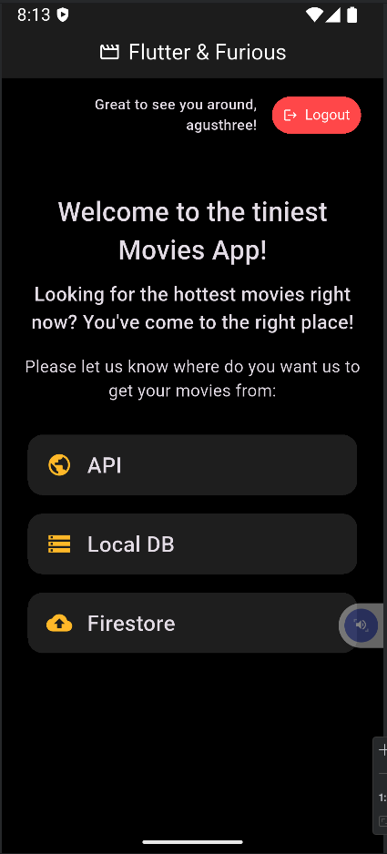
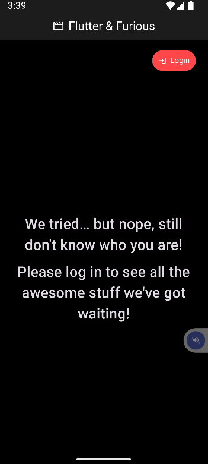
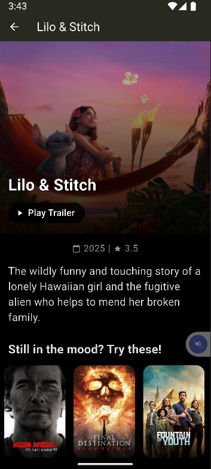

# dojo_challenge_app

Simple Flutter app to integrate some features and good practices of design and code (services, databases, SOLID principles, clean architecture, design patterns, dependency injection, among others).

Screenshots and demo

- Initial version: 

  
  
  

- Updated version: 

  
  
  

  
  
  

